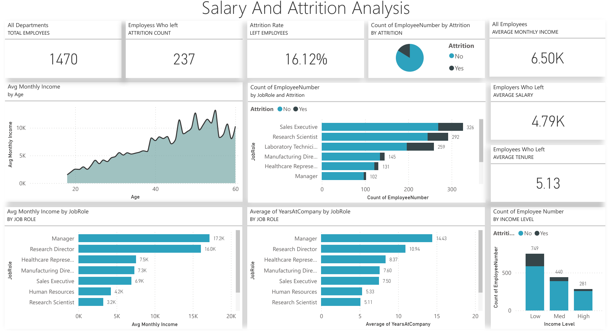
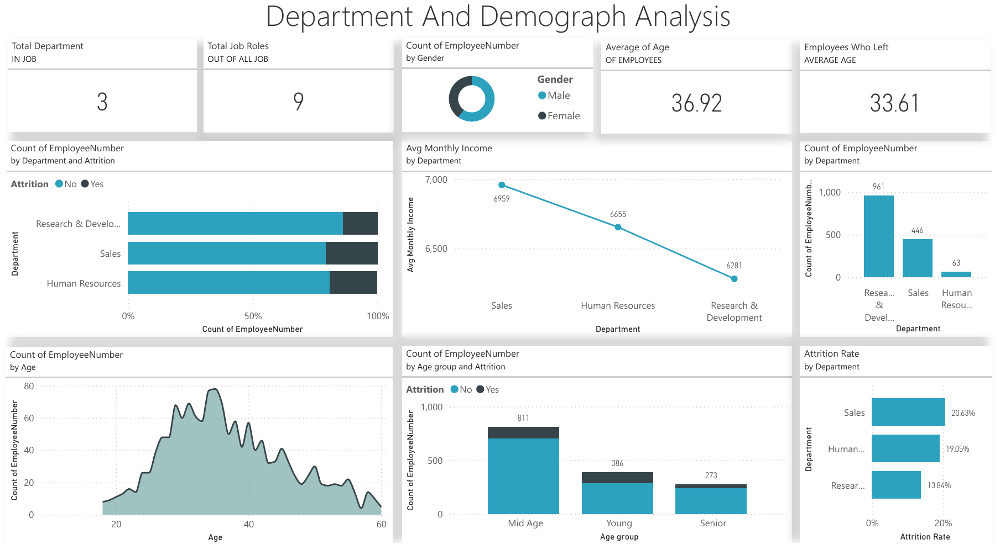

# Employee Attrition & Performance Analytics Dashboard

An interactive Power BI dashboard built using the IBM HR Analytics Employee Attrition & Performance dataset to analyze employee attrition, salary patterns, job roles, departments, demographics, and workforce trends.

## 🔗 Live Power BI Dashboard

[View Interactive Power BI Dashboard](https://app.powerbi.com/links/Sp3hopmxfI?ctid=e14e73eb-5251-4388-8d67-8f9f2e2d5a46&pbi_source=linkShare)

---(you may need to sign in your PowerBi account)

## Dashboard Preview

### Salary & Attrition Analysis

This dashboard analyzes overall employee attrition, salary patterns, job-role distribution, employee tenure, and income-level trends.

### Department & Demographic Analysis

This dashboard analyzes department-level workforce composition, demographics, age distribution, and department-wise attrition.

---

## Key Metrics

| Metric | Value |
|---|---:|
| Total Employees | 1,470 |
| Employees Who Left | 237 |
| Attrition Rate | 16.12% |
| Average Monthly Income | 6.50K |
| Average Salary of Employees Who Left | 4.79K |
| Average Tenure of Employees Who Left | 5.13 years |

---

## Analysis Covered

### Salary & Attrition

- Overall employee attrition
- Attrition by job role
- Attrition by income level
- Average monthly income by age
- Average monthly income by job role
- Average years at company by job role
- Employee tenure and workforce trends

### Department & Demographics

- Department-wise employee distribution
- Department-wise attrition
- Department-wise attrition rate
- Department-wise average monthly income
- Gender distribution
- Employee age distribution
- Age-group analysis
- Attrition across age groups
- Job-role distribution

---

## Tools & Technologies

- Microsoft Power BI
- Data Visualization
- Data Analysis

---

## Dataset

IBM HR Analytics Employee Attrition & Performance dataset.

**Source:**  
https://www.kaggle.com/datasets/pavansubhasht/ibm-hr-analytics-attrition-dataset

---

## Project Files

- `screenshots/` — Dashboard screenshots
- `IBM_HR_Analytics_Attrition.pbix` — Power BI project file, if included

---

## Project Objective

The objective of this project is to transform employee-level HR data into an interactive analytical dashboard that enables exploration of attrition, compensation, workforce composition, and demographic trends.
